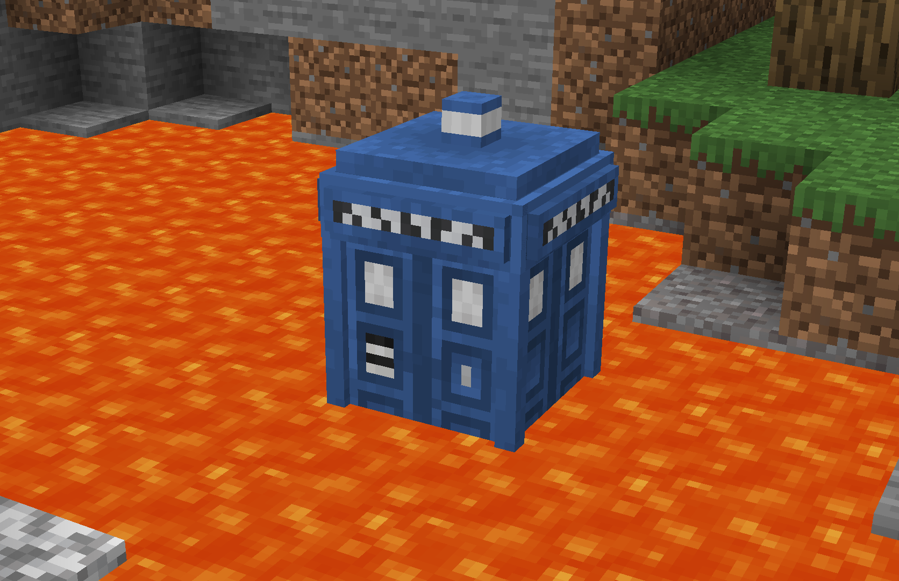

# Flying a TARDIS 101

The primary function of a TARDIS is, of course, travel. In order to travel from one place to another, your TARDIS
must first dematerialize, travel the time vortex, and then rematerialize at a set destination.
This page is intended to serve as a non-comprehensive guide for these operations,
and should provide a complete enough overview to safely traverse your first flight.

## Locating your destination

To select a landing location, make use of the [GPS] app and [Localization Corrector] buttons. 
A conventional console will have two opposite facing sets of these for horizontal modifications, 
plus one additional [Lateral Corrector] connected to a state switch for vertical control.

The GPS app will show you your current location in the world and selected destination.
Each corrector will nudge your destination a certain amount of blocks in one cardinal direction, 
dependent on the value your [Scale Interpreter] is set to. 

The lateral corrector functions a little differently, as instead of moving in X block increments, 
it snaps to the nearest valid landing spot in the current vertical column.
This lets you easily target caves or floating structures as your destination.
The direction it moves in is dependent on the attached state switch (the comparator-looking thing).

!!! note

    Whilst this is all possible to do during flight, 
    setting and verifying your destination beforehand is usually recommended
    to prevent potentially stressful situations and reduce energy usage from being dematerialized.

!!! tip
    
    If you have access to the [Terrain Scanner] app, you can use that to verify and fine-tune your landing location.

[GPS]: # (TODO)
[Localization Corrector]: console_layout.md#target-localization-corrector
[Lateral Corrector]: console_layout.md#lateral-target-localization-corrector
[Scale Interpreter]: console_layout.md#localization-scale-interpreter
[Terrain Scanner]: # (TODO)

## Pre-flight Checklist

Before taking off you'll want to run through a quick checklist to ensure a safe trip. 
All immediately flight-relevant information is shown in the [Status] app.
- Artron capacitors should be over ~25% charged.
- Preferably, ensure your stability gauge is full.
- If possible, use your terrain scanner to verify landing zone safety. 
  (Your TARDIS *can and will* happily land inside a lake of lava or on the ocean floor)

!!! tip

    You can recharge your artron capacitors by switching to refueling mode while landed.
    Make sure your [Artron Conduits] are closed and activate the [Artron Scoop] to engage the refueling process.

    **Artron energy is everywhere, and thus, essentially free!** It might take a while to gather though.

[Status]: # (TODO)
[Artron Conduits]: console_layout.md#artron-conduit-controller
[Artron Scoop]: console_layout.md#artron-scoop-activator

## Taking off

At this point, you should be ready for take-off!
First, lock in your destination using the [Target Lock-in] button. This will prevent you from modifying it, 
and is required for both the take-off and landing sequence.

Your [Artron Conduits] must also be open to provide energy to the time rotor.
While active, these will constantly slightly drain your energy supply due to minor transfer inefficiencies,
so leaving them enabled constantly, while possible, is not practical.

// TODO

!!! tip

    You can safely unlock and modify your destination, and use many other TARDIS controls once 
    you're fully dematerialized, allowing for last minute course corrections.

[Target Lock-in]: console_layout.md#space-time-target-lock-in
[Artron Conduits]: console_layout.md#artron-conduit-controller

## Landing

## Addendum: Interdimensional Travel